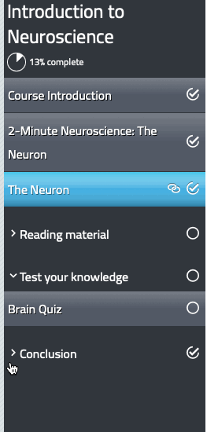

As you're adding documents to the Assembler, they'll appear in a list on the left side of the screen. This represents the order in which the items will display, as well as the table of contents that will be displayed in menu-based layouts.

### Selecting (and viewing) an item

To select an item, simply click on its name in the document list. The item will display in the large area to the right of the list, while the item name will have a dark overlay to indicate it's currently selected. You can only select one item at a time.

Selecting a page also allows you to use keyboard shortcuts for all the other actions on this page - for a full list of shortcuts, [go here](other-options/shortcuts)!

### Renaming items

To rename an item, double-click on its name in the document list. The name turns into a text field, allowing you to type in a different name. Press **Enter** on your keyboard whenever you're done to save the new name.

### Rearranging items

To rearrange an item, click and hold the wavy icon to the left of the item title, then drag up and down the list. Release the mouse when you're in the correct position to drop it there.

### Sections

A section is a logical grouping of one or more navigation items and represents a SCORM objective. The course always has one Objective, and subsequent sections add objectives. Sections have a tick (if enabled by the theme) when all items within that section are completed.

In the Menu and Dock themes, the sections represent expandable menu items. Users can expand or contract these menu groupings, and they also expand when required by the navigation to show the current item.

Objective data is supported in Scorm 1.2 and Scorm 2004.

### Indenting items (parent and child items)

Items can be indented - up to 3 levels of indentation are possible. This is a visual change only that may be supported in some themes. An 'indented' item is shown underneath the item above that has a lower indentation.

Change the indentation by clicking on the three-way toggle icon. Subsequent (lower) pages may need to change to support your indentation. You can't indent a page more than one place away from its parent (higher) item.

When you upload multi-page documents into the Assembler and [split them](add-documents/item-options#split) (or upload with [auto-split documents](other-options/app-defaults#auto-split-documents) enabled), all pages after the first page are automatically indented to become child items. Of course, these items can then be individually indented, rearranged and edited however you wish, so please never feel you have to be stuck with that.

!! In some themes, items are rendered in a drop-down box such as a Select box and indentation is represented using dashes. No expansion or other styling functionality is possible with select boxes.