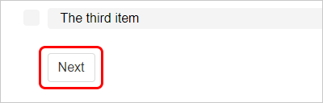

When testing the quiz or viewing it as a user, the quiz interface is kept fairly neat and basic. An avaerage layout consists of a title, a numbered list of questions (and the Results button for grading questions), the currently selected question and the answers for you to choose from.

### Navigating the quiz

All the questions in the quiz will be listed as numbered buttons at the top of the screen. Simply click on a number to go to that question.

Alternatively, click the **Next question** button below your answer choices to move onto the following question.

### Answering questions

To answer a question, simply click on any of the available answers.

If a question is single choice, answers will be filled in with a dot point and you will only be able to select one answer at a time.

If a question is multiple choice, answers will be filled in with a tick mark and you will be able to select several answers simultaneously.

### Marking your answers

When you select an answer, your choice is NOT immediately marked, allowing you to go back and change your selection if you think you answered incorrectly.

Once you are ready to finalise your answers, you may have two choices, depending on what you selected in the quiz settings.

Normally, you can just submit your answers all at once by clicking on the **Results** button.

Clicking this will give you a dialogue box asking for confirmation.

Clicking _OK_ will submit your answers and display your score. Depending on your quiz settings, you may have a button here allowing you to resit the quiz if you failed an attempt.

!! You can submit your answers without answering all the quiz questions - but you will not be able to go back and answer the ones you missed (or change the answers you got wrong) unless you resit the quiz all over again!

However, if your questions have a **'Check Answer'** button below your answer choices (replacing the _Next question_ button until after it's clicked), clicking it will _immediately_ submit and mark the current question. You can still use the question numbers up top to skip ahead and answer other questions beforehand.

Questions that have been marked can also display whether they were correct or incorrect by highlighting themselves in green or red colours. These appear in both the question itself and its corresponding number button (questions that have been skipped will remain blank). Once again, depending on your quiz settings, this can be disabled if you prefer.

