This is the first area of the Quiz wizard, and the options here control the interface and functionality of the quiz.

---

#### Title

Allows you to enter a custom title for the quiz.

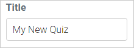
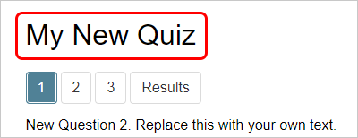

! This does not affect the title of the item displayed in the document list - to change that, use the normal method of changing item names by double-clicking the name in the list!

#### Mark answers

Determines when question are marked and if correct or incorrect answers are shown. Pick an option from the drop-down menu.

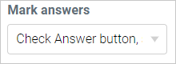

* **Check answer button, show status:** Questions have the _Check Answer_ button, allowing you to mark answers immediately, before showing the _Next Question_ button to proceed through the quiz. Correct or incorrect questions are identified via green or red colours.
* **Mark on completion, show status:** Questions only have the _Next Question_ button. Answers will not be marked until the quiz is completed. Correct or incorrect questions are identified via green or red colours.
* **Mark on completion, do not show status:** Questions only have the _Next Question_ button to proceed through the quiz. Answers will not be marked until the quiz is completed. Correct or incorrect questions are not identified.

#### Question ordering

Determines how questions are ordered in the quiz. Pick an option from the drop-down menu:

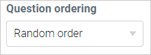

* **Random order:** Questions will be loaded in a randomised order.
* **Natural order:** Questions will be loaded in the order they are arranged in the wizard.

#### Show questions

Determines how many of your questions will be loaded by the quiz. Type in a number between 1 and the maximum number of questions you have.

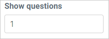

#### Pass mark

Determines how many questions you need to answer correctly in order to pass. Type in a number between 1 and the maximum number of questions you have.

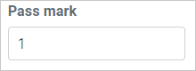

#### Results button text

Allows you to enter a custom label for the _Results_ button.

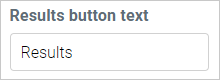
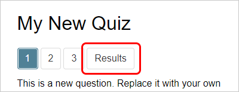

#### Answer button text

Allows you to enter a custom label for the _Check Answer_ button.

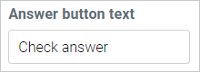
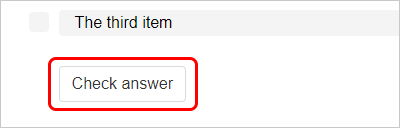

#### Next question button text

Allows you to enter a custom label for the _Next question_ button.

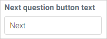
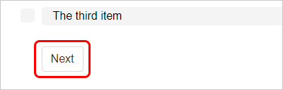

#### Resit button text

Allows you to enter a custom label for the _Resit_ button.

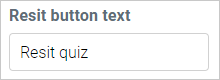
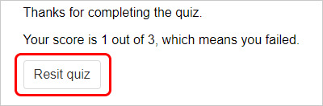

#### Resit button (checkbox)

Checkbox used to enable / disable the _Resit_ button. If a user fails the quiz, this button allows them to try again (i.e. 'sit' the quiz again - 're-sit'. Not a typo of 'reset'!).

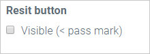

! 'Visible (< pass mark)' just means that even if the button is enabled, it will only show up as long as the user scores _less than_ the required pass mark. Once the user passes the quiz, the button will be disabled anyway.

#### Results page template

Allows you to customise the text shown on the Results page at the end of the quiz. By default, this text field uses HTML coding to display the score and passing / failing statements - you can delete this if you wish, but if you want the original text back at any time, click the **Reset** button at the top right corner of the text field.

#### Button colour

Allows you to pick a custom colour for the Quiz buttons. Click in the text box and either pick a colour from the palette that appears, or type in a colour hex code (e.g.: #1a2b3c).

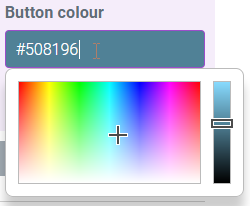
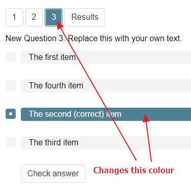

---

#### Save settings

To save your changes, click the large purple button in the bottom right corner of this area.

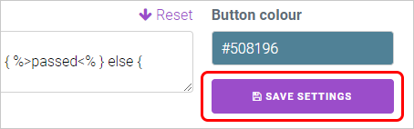