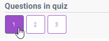
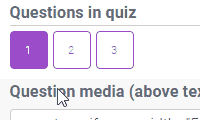
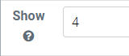
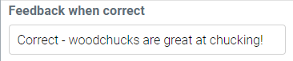
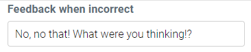
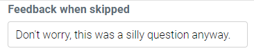
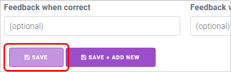
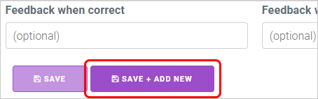
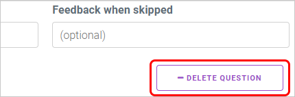

This is the second area of the Quiz wizard, and the options here allow you to add and manage your quiz questions.

! Course Assembler quizzes only support _Single Choice_ and _Multiple Choice_ questions - if you're looking for a quiz with more options, the [Course Engine's capabilities](/engine/course-landing-page/properties/quiz/question-types) may suit your needs!

---

#### Questions in quiz

These are numbered buttons for ever question in your quiz. To edit a question, simply click on a button to open it below.

If the _Question ordering_ setting is using _Natural order_, you can click and drag the number buttons left and right to rearrange the order of your questions. If set to _Random order_, this functionality will not work.

#### Add new question

To add a new question, click the purple '+' button to the right of this area.

! Don't forget to save a question before switching to another one - otherwise, changes may be lost!

#### Question media

This field allows you to place an optional image or video above the question text.

For images, just drag and drop a picture file in this area. It will appear in this area as HTML coding - it'll look a little messy, but it'll work!

For streaming media (YouTube, Vimeo, SoundCloud), copy the media's embed code, click back on this area and paste (Ctrl+V) the code into it.

!! You will need to use the proper HTML embed code for the media this time - standard web address URLs will not work!

! If items appear odd or misaligned, you can add other HTML tags (such as < center > or < br >) into the code to fix them!

#### Question text

Self-explanatory - this is your question! Delete the placeholder text and replace it with your own content.

---

This next group of options allows you to set up your answers, or 'distractors' as they're referred to in the wizard:

#### Correct (checkbox)

Checkboxes used to designate correct choices. If a distractor is checked, users will need to select it when answering the question in order to pass it.

You can check either a single distractor (for a single choice question) or check multiple distractors (for a multiple choice question).

! If making a multiple choice question, remember that users will have to select ALL your correct distractors to pass the question - if they only pick one or the other, it will count as a fail!

#### Distractor text

Also self-explanatory - this is a possible answer! Delete the placeholder text and replace it with your own content.

You can also rearrange the order of your distractors if you need to - just click and hold the mouse in the small empty area below the Correct checkbox and drag up or down the distractor list to move it to a new position.

#### Delete distractor

To delete a distractor, click the small 'x' button to the right of the distractor text field. The distractor will immediately be removed, so be careful!

#### Show (number of distractors)

Determines how many of your distractors will be loaded for the question. Type in a number between 1 and the maximum amount of distractors you have.

If the Show number is smaller than the number of distractors in a question, the distractors will randomise. If the Show number matches the number of distractors, they will always appear in the order you have them in the editor.

#### Add new distractor

To add a new distractor, click the small '+' button to the right of the Show text field. A blank distractor will be added to the bottom of the list.

---

The next group of options allows you to add short feedback messages to display once a question has been marked.

These are optional - type in your own content if you want, but if not, you can leave these fields blank. These are also unique to each question, so different questions can have different feedback text.

#### Feedback when correct

Allows you to type a message to display on the question when you get the answer correct.

#### Feedback when incorrect

Allows you to type a message to display on the question when you get the answer incorrect.

#### Feedback when skipped

Allows you to type a message to display on the question when you skip a question ( when you go to the _Results_ page and submit your whole quiz for marking without selecting an answer)

---

#### Save

To save your changes, click the first (smaller) purple button in the bottom left corner of this area.

#### Save + Add New

To save your changes and add a new question at the same time, click the second (larger) purple button in the bottom left corner of this area.

#### Delete Question

To remove the current question, click the large white button in the bottom right corner of this area. The question will immediately be removed.

