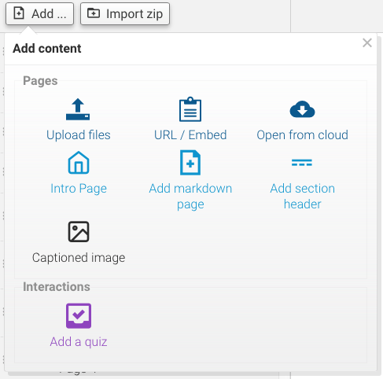

To get any use out of the Course Assembler, we'll need some documents!

Let's get started by clicking the **Add content** button toward the top left corner of the Assembler.

The following popup should appear:

! If you have no documents in the Assembler when you first open it (whether using it the first time or after a reset), this popup opens automatically to save time!

From here, we have several options available for uploading stuff into the Assembler:

### Drag and drop files

This is the simplest method - just click and drag a file from the desktop over the Assembler, then drop it into the Assembler to upload it. There's an area marked by a dotted outline, but you don't *have* to just drop it there - as long as the popup's open, you can drop it anywhere!

(Keep an eye on the dotted area anyway, though - if it turns dark grey, you're all good to drop your file. If it doesn't, it's a handy indicator that your browser might not support the drag/drop method)

If you want to upload a web page or add streaming media (YouTube, Vimeo, SoundCloud), open the web page in a new browser window and highlight the URL in your browser's address bar. Then drag that address into the Assembler and drop it in.

### Upload from your computer

Use this to upload files from your PC the old fashioned way - click the dotted outline area and a window will open, allowing you to manually search for your file. Once you've got it, click on it once to select it, then click *Open* to upload it.

### Paste in an URL

Use this to upload streaming media and web pages the old-fashioned way - copy the web page URL from your browser's address bar and paste it into the text box provided, then click the *Insert* button below to upload it.

### Upload from the Cloud

If you have files on a cloud storage account (such as Dropbox, Google Drive, OneDrive, etc) you can use them too! Under 'Upload from the Cloud', click the *Choose* button and a popup will open, allowing you to connect a cloud storage service if supported by the Assembler (or just navigate to your files if you've already linked an account).

Once you've found your file, click on it to select it, then click the blue *Select* button in the bottom right corner to upload it to the Assembler.

! For more detailed information on how to manage the cloud storage popup, see [Cloud storage management](other-options/cloud-management).

---

Each document will appear in the list and each item represents a 'page' in the final content package. Files are converted to HTML5 when uploaded to the Assembler - during file conversion, the left menu will change to show the conversion taking place (you can cancel it at any time by clicking the 'x' icon to the right of the file name). You can also continue working on other documents or dragging more documents onto the browser while files are still uploading.

Files are also stored in your browser forever (or until you delete them or press Reset). This means you can close your browser and come back tomorrow and the files will still be loaded and ready.