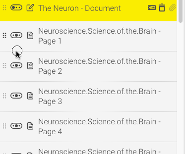

As you're adding documents to the Assembler, they'll appear in a list on the left side of the screen. This represents the order in which the items will display, as well as the table of contents that will be displayed in menu-based layouts.

### Selecting (and viewing) an item

To select an item, simply click on its name in the document list. The item will display in the large area to the right of the list, while the item name will have a dark overlay to indicate it's currently selected. You can only select one item at a time.

Selecting a page also allows you to use keyboard shortcuts for all the other actions on this page - for a full list of shortcuts, [go here](other-options/shortcuts)!

### Renaming items

To rename an item, double-click on its name in the document list. The name turns into a text field, allowing you to type in a different name. Press **Enter** on your keyboard whenever you're done to save the new name.

### Rearranging items

To rearrange an item, click and hold the wavy icon to the left of the item title, then drag up and down the list. Release the mouse when you're in the correct position to drop it there.

### Indenting items (parent and child items)

To indent an item, click the rounded button to the left of the item title. Click the button again to outdent an item. You are only able to indent or outdent by one level.

If you end up picking a visual theme with a menu or index (such as [Drop Down](choose-design/basic-themes#drop-down), [Drop Up](choose-design/basic-themes#drop-up) or [Side Bar](choose-design/basic-themes#side-bar)), indents determine whether items are *parent* or *child* items. In layman's terms, it's a simple hierarchy system - child (indented) items become 'sub-pages' branching out from underneath whichever parent (outdented) item is above them in the document list. When your course is played, child pages will also be hidden from view in the menu until the parent item is selected. So indents can be quite handy for grouping items with common topics or information.

When you upload multi-page documents into the Assembler and [split them](add-documents/item-options#split) (or upload with [auto-split documents](other-options/app-defaults#auto-split-documents) enabled), all pages after the first page are automatically indented to become child items. Of course, these items can then be individually indented, rearranged and edited however you wish, so please never feel you have to be stuck with that.

!! For themes without a menu (such as [Carousel](choose-design/basic-themes#carousel) or [Nano](choose-design/basic-themes#nano)), indented items have no effect and are thus rendered moot.