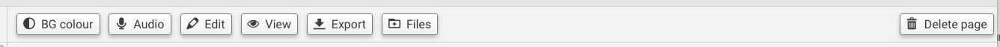
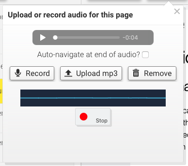
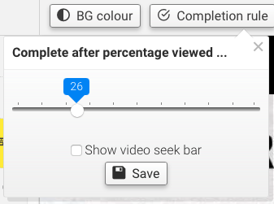

Once you select a file from your list to view it, you'll notice a bunch of options in the thin blue bar above your content. Each item, or 'page', in your course gets these options - though some item types get different or additional options that others.

To start with, here's the options that every item will have:

### Background colour

When you import a file, the Assembler will automatically pick a background colour it thinks will look nice, depending on the content of the document. However, if you're not a fan of the Assembler's sense of decoration, you can easily change this.

To change an item's background colour, click on the **BG Colour** button in the top left and the following popup will appear.

From here, you can pick any of the four shades (Black, Dark grey, Light grey, White) or click the 'Choose a colour' button to pick a custom colour. You can also set the same background colour for all of your items in the Assembler if you wish, using the 'Apply to all pages' checkbox.

When you're done, hit the *Save* button to confirm your choice.

### Page title

In the middle of these options, the item title is also prominently displayed. You can rename items, but that isn't handled here anymore - go to [Arranging your items](add-documents/arranging-items) to see how that works!

### Deleting a page

Sometimes an item just needs to go. Courses move on; change of plans; you uploaded your dog's photo instead of your own - it happens to everyone! Don't worry though, deleting an item is also quite easy.

To delete an item, click the **Delete page** button to the very right of the thin blue bar. You will be asked to confirm before continuing. Clicking _Yes_ will immediately delete the item, while clicking _No_ will cancel the action.

---

Depending on the type of document you're viewing, you'll also have access to some additional options:

### Audio

This option appears on all items except streaming media and quizzes. It's used to add an audio file to your item to accompany the current content. It's also got quite a few options within itself, but here's what you need to know.

To add an audio file, click the **Audio** button in the top left and the following popup will appear.

From here, you can either play your current audio (if any is present), record your own audio or upload an MP3 file from your deskop.

To record audio from your microphone, click the *Record* button. An additional area will appear at the bottom of the popup.

Click the second *Record* button once to start recording, then click it again when you're finished. You can preview your recording using the player provided, then click *Accept* to confirm your audio.

! If using this for the first time, you may get a notification from your web browser asking for permission to use your microphone. You'll need to accept it to allow recording.

To upload an existing audio file from your computer, click the *Upload MP3* button. A window will open, allowing you to manually search for your file. Once you've got it, click on it once to select it, then click *Open* to import it.

To download your current audio file, click the 3-dot icon that appears to the right of the player, then click the *Download* button. This will be useful if you want to edit recordings in external software before reuploading to the Assembler.

To delete your audio, click the *Remove* button and it's gone. This deletes it immediately, so be sure you want it gone before clicking!

On a final note, there's also a handy speaker icon to the right of the audio button to indicate whether an item has audio attached. If it's a standard icon, there's audio attached. If it's got a line through it, there's nothing here!

### Completion rule

This option only appears on streaming media items. It's used to determine when the media will be marked as 'complete' as your users watch through it.

To change the completion point, click on the **Completion rule** button in the top left and the following popup will appear.

The completion point is determined by a percentage slider and set to 50% by default (meaning the video is marked 'complete' at its halfway point). Click and drag the slider to the left or right to adjust the percentage to your preferred point.

When you're done, hit the *Save* button to confirm your choice.

### Split

This option only appears on multi-page documents (such as Word docs, Excel sheets and PDFs) if they're uploaded to the Assembler while 'Auto-split documents' is disabled ([more on that here](other-options/app-defaults)). These type of documents will initially take up only one item in the Assembler, but you may prefer to have their pages broken up into individual items instead.

To split a document, click on the **Split** button in the top left. The document will immediately be broken up into individual items, with each item listed as its own entry in the document list.

When a document is split, we automatically indent all items after the first by deafult, though you can easily edit this (and also rename, rearrange and/or delete items at your leisure).

!! Splitting a document cannot be undone - if you want to reverse it, you'll have to upload the original file again!