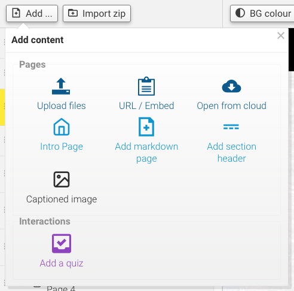
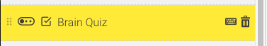
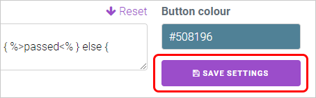
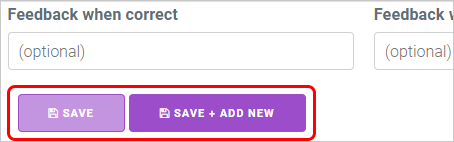

So we've added our documents, but guess what? We can also add quizzes to really test those brain cells!

Let's get started by clicking the **Add quiz** button toward the top left corner of the Assembler.

The Quiz Wizard will appear in the content area. A new item will also appear at the bottom of the document list, labelled *New Quiz*.

This is where you'll adjust the settings for the quiz, along with adding and customising questions. (The questions part will be blurred by default, but don't panic - it'll clear up once you select a question to edit).

Both of these settings have a fair bit of information to cover, so we'll detail how they work in the next few pages.

---

You'll also notice that Quiz items also feature their own unique options in the thin blue bar above the wizard. In the top left, we have the **Edit** and **View** buttons.

Clicking _View_ allows you to preview how the Quiz will look when the course is run.

!! In order to preview the Quiz, you will need to save the quiz at least once. To do this, click any of the three **Save** buttons throughout the wizard.

Clicking _Edit_ switches you back to the wizard editor.

