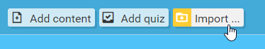

As a last feature before we move on, imagine this situation: you've made a course in the Course Assembler and downloaded it a while ago, but you've realised since then it could use a few changes. Some added content, a few tweaks here and there, a layout change - whatever! Point is, you still have the zip package you downloaded from back then, and you *really* don't want to make the whole course over again.

Good news! We've got your back there too!

Let's get started by clicking the **Import...** button toward the top left corner of the Assembler.

The following popup should appear:

From here, we have several options available for importing packages into the Assembler:

### Drag and drop packages

This is the simplest method - just click and drag a package from the desktop over the Assembler, then drop it into the Assembler to upload it. There's an area marked by a dotted outline, but you don't *have* to just drop it there - as long as the popup's open, you can drop it anywhere!

(Keep an eye on the dotted area anyway, though - if it turns dark grey, you're all good to drop your package. If it doesn't, it's a handy indicator that your browser might not support the drag/drop method)

### Import from your computer

Use this to import packages from your PC the old fashioned way - click the dotted outline area and a window will open, allowing you to manually search for your package. Once you've got it, click on it once to select it, then click *Open* to import it.

### Import from the cloud

If you have packages on a cloud storage account (such as Dropbox, Google Drive, OneDrive, etc) you can use them too! Under 'Import from the Cloud', click the *Choose* button and a popup will open, allowing you to connect a cloud storage service if supported by the Assembler (or just navigate to your packages if you've already linked an account).

Once you've found your package, click on it to select it, then click the blue *Select* button in the bottom right corner to import it to the Assembler.

! For more detailed information on how to manage the cloud storage popup, see [Cloud storage management](other-options/cloud-management).

---

Once you import the package, all of the package items will appear in the document list on the left hand side of the Assembler with their original settings.

!! **IMPORTANT:** Importing packages currently does not replace any existing documents already in the Assembler, but adds to them instead. If you want to import the package exactly as it was originally saved, [reset the app](other-options/reset) before importing your package!