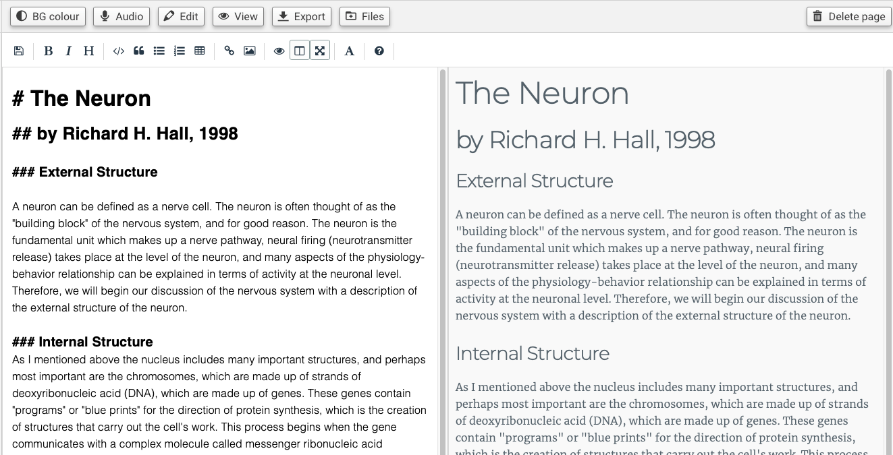
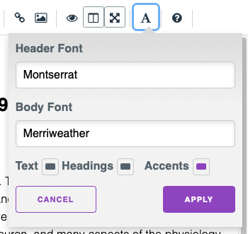

You can insert Markdown pages and use a simple editor to add content. You can add images to your markdown by dragging them onto the markdown editor.

You can change the font or accent colours of the document by clicking on the A icon on the toolbar and then choosing the appropriate option on the tool panel. You will see a real-time preview of your change if you have the Preview tool open in your editor window.

