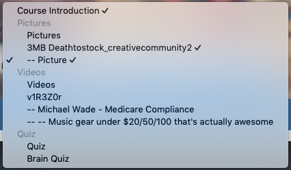
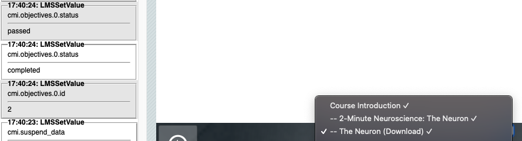

Sections represent logical groupings of pages in the navigation. It also maps to a SCORM objective. Depending on the theme, a section may have an icon representing the completion status of all the pages within the section.

In themes that contain a menu, sections are expandable by either the user or automatically to ensure the current page is shown.

In themes that contain a drop-down list the sections are represented using Option Groups - non-selectable labels within the list.

Each time a section is added to the menu, a new SCORM objective is added and the completion of navigation items within that section contribute to the completion status of that objective.

