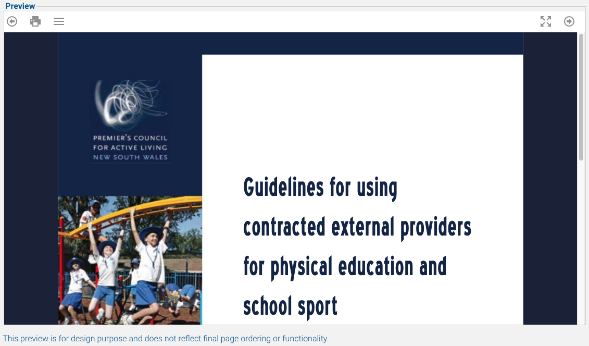

You can choose from a range of /navigation styles/ and /preset themes/ to quickly provide a way for your learners to navigate the package. Different navigation styles offer their own presets, and you can customise any of them to suit your particular needs. It's best to first add a few documents to the Course Assembler before you decide on a design, as you will get a feel for the layout and functionality of the final package.

> NOTE:
> This preview is for design purpose and does not reflect final page ordering or functionality. You can use the 'Preview' function under the Download page to see final functionality.

To begin, select a Navigation style from the top list. This sets the broad style capability and player functionality that will be used when publishing the course. All navigation styles offer the same core engine but may customise other aspects of the player to suit the exact needs of the layout. A preset is not 'just' a css file. Fully custom players may be offered in the future.

Next, select a preset. A preset is a series of commands and colours that are used to define the specific look of a navigation style. Some styles offer simply colour choices whilst others offer functional changes too. A list of all possible changes is shown on the *Customise Presets* page.

A preview of your content will appear at the bottom, which is functionally operable but some items may not appear or work. During the preview the order of pages shown is not preserved. You can click on items, use the arrow keys to navigate, etc. Attachments and audio files are shown but do not function, and some content plugins do not function propertly (such as h5p content).

