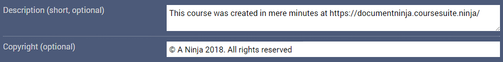
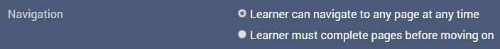
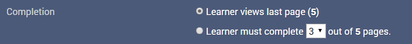
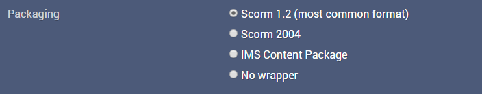

Before you can download the wrapped SCORM package, you must give the package a name - once you think of one, simply type it into the top text field.

Below that, you also have the option of typing up a short description of the package, as well as a copyright statement. Both of these are, well, optional and can be left blank if need be.

! If you want to type the copyright symbol, either hold the Alt key and type 0169 in the numpad (Windows) or hold the Option key and press G (Mac).

This information is normally stored as metadata inside the package files, though if you're using the Side-Bar, Drop-Down or Drop-Up navigation styles, the package name and copyright text will also be displayed when the package is played. Plus even if the information is not visible, it may come in handy for providing additional information and/or author details if the package is shared to others.

---

Since the Course Assembler can handle multi-page packages, we have a few extra options available if you need them:

You can set whether users can navigate freely between pages in any order they choose (if using a nav layout with a table of contents) or whether they must complete each page in their sequential order. if the latter is picked, users will be locked out of later pages till the ones preceding them are completed.

!! This option currently works only with embedded media pages (due to their completion markers) - other pages will not prevent access to those after them.

You can also set when the overall package counts as complete - either when the user visits the last page (default) or when a set number of pages have been viewed.

The final step before downloading the package is to choose the wrapper it should use - the default (and most common) is SCORM 1.2, but if you need to use either SCORM 2004, an IMS Content Package or no wrapper at all, both of those options are also available. Just click on the respective radio button to choose the wrapper you need.

