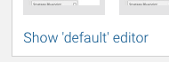
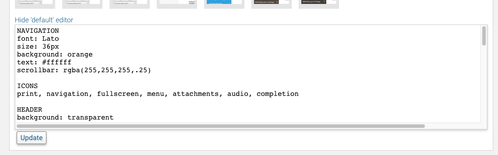

Underneath every preset there is an editor (closed by default) which allows you to customise any of the supported values of the current preset. You can *save these changes* which is stored against your licence key and will survive a 'reset' - this is a handy way to ensure all your content has the same visual settings each time.

The editor is accessed by expanding the edit button underneath any preset. The wording will show the current preset name.

The expanded editor shows a text field you can edit. Press the 'Update' button at the bottom to apply and preview your changes.

##Editing presets

A preset is made up of a number of sections each with a number of settable properties. If a property isn't specified or is not formatted properly, it is ignored and an internal fallback will be used instead. Different Navigation styles offer some or all preset values. If you use a section from an unsupported navigation style it will generally be ignored.

A preset has the common format of

	SECTION NAME
	property: value

The `section name` is in UPPERCASE and must match one of the full list of supported names, listed below.

A `property` and `value` are also known values that are needed to build the final theme. Properties are matched by navigation styles and any unknown properties are ignored. Values are written to CSS variables or used the hide and show various parts of the code, css or html used by the navigation style. You cannot edit the underlying HTML or associated files for a navigation style.

Any other values (e.g. comments, blank lines) are ignored.

Some `property` values can take different forms - particularly for turning features on or off. For instance, to tell a property to use its internal default you simply delete the whole line. To tell a property that turns an item on or off you can use a negative word - for instance `off` is the same as `false`, `no`, `none` and `0`; likewise a positive word `yes` could also be written as `true`, `1` or `on`. Examining different presets will show you different verbs but they all have the same effect. There is no correct or incorrect word to use. Some properties are effectively CSS properties - if you know CSS you can get creative with your presets.

## Supported Sections and Properties

Listed below are the section names and each of the possible properties with their defaults. Anything that isn't matched is considered a comment in the file and gets ignored.

###NAVIGATION

*font* : `Open Sans`

This is the name of a Google Font (other fonts are not supported). The font will be referenced by the final package as a link to Google Fonts (e.g. not downloaded/embedded). You can only specify one font.

*size* : `16px`

This is the base size of a fonts used in the theme AND the basis of any padding and margins applied.

*background* : `#ffffff`

This is the page background colour. It is written to the page using the css `background` shorthand property so you can specify anything that CSS tag supports including gradients, data-encoded images, multiple backgrounds, etc. 

*text* : `#000000`

This is the default text colour for the page.

*scrollbar* : `rgba(0,0,0,.25)`

This is the colour of the scrollbar for the menu. You can specify any CSS-supported colour value here.

----

Applies to: Menu, Dock

###HEADER

*background* : `#2E79A4`

This is the header background colour. It is written to the page using the css `background` shorthand property so you can specify anything that CSS tag supports including gradients, data-encoded images, multiple backgrounds, etc. 

*text* : `#ffffff`

This is the default text colour for the header and its icons.

*image* : ` `

You can point to an image to insert above the course title. You should specify a https url and point to a file that will be always available. You can also specify CSS data url.

*shadow* : `false`

Whether text and icons have a shadow. Can be `false` for none or a colour value e.g. `rgba(0,0,0,.25)`. The shape and distance is predetermined by the navigation style.

*title* : `true`

Whether or not to show the Course Title.

*description* : `false`

Whether or not to show the Course Description

*progress* : `false`

Whether or not to show a progress graph indicating how much of the course is completed.

----

Applies to: Menu, Dock

###ICONS

You can use any of these names in a comma-separated list to turn on icons. If you don't specify a name the icon or set will be turned off. Possible values are:

`print`, `navigation`, `fullscreen`, `menu`, `attachments`, `audio`, `completion`

*print* : Whether or not the PRINT icon will be displayed. Printing allows the currently displayed page to be sent to the printer. Printing multiple pages is not supported. You should supply the user a document (perhaps using a File Attachment) if you require multi-page printing.

*navigation* : Whether navigaiton buttons (arrows) are visible to allow the user to navigate forward or backward through content. Note tht removing the icon does not change the functionality - users can still use keyboard shortcuts or other menu styles to navigate.

*fullscreen* : Whether the full-screen toggle icon is shown. If full-screen support is not available on the users device the icon will be automatically hidden.

*menu* : the 'hamburger' or menu toggle icon. Some mobile devices will automatically show a menu icon (in some navigation styles) irrespective of this setting.

*attachments* : Whether or not to show a paperclip icon next to menu items (in supported navigation styles, such as Menu and Dock) for pages that contain file attachments

*audio* : Whether or not to show a speaker icon in menu items (in supported navigation styles, such as Menu and Dock) for pages that contain audio

*completion* : Whether or not to show the completion icon in menu items (in supported navigation styles, such as Menu and Dock). Removing the icon does not disable completion.

----

Applies to: All navigation styles.

###FOOTER

*background* : `transparent`

This is the footer background colour. It is written to the page using the css `background` shorthand property so you can specify anything that CSS tag supports including gradients, data-encoded images, multiple backgrounds, etc. 

*text* : `#000000`

This is the default text colour for the footer any any icons.

*shadow* : `false`

Whether text and icons have a shadow. Can be `false` for none or a colour value e.g. `rgba(0,0,0,.25)`. The shape and distance is predetermined by the navigation style.

*copyright* : `true`

Whether or not to show the copyright string in the footer.

*brand* : `true`

Whether or not to show the Course Assembler branding row in the footer.

###ITEM

A menu item row.

*background* : `rgba(81, 159, 212, .25)`

The background colour of all items in a menu. It is written to the page using the css `background` shorthand property so you can specify anything that CSS tag supports including gradients, data-encoded images, multiple backgrounds, etc. You can also use `transparent`. This property is inherited by SUBITEM and SELECTION.

*text* : `#ffffff`

This is the default text colour for navigation items such as in a Menu.

*shadow* : `rgba(0,0,0,.25)`

Whether text and icons have a shadow. Can be `false` for none or a colour value e.g. `rgba(0,0,0,.25)`. The shape and distance is predetermined by the navigation style.

*padding* : `.25rem`

The space between any text and the edge of the box, in any CSS notation such as `10px` or `1rem`. You can use `0` or `false` to turn off padding.

*rounded* : `false`

Specifies a 'radius' for the edge of the box in CSS notation such as `10px` or `.25rem`. You can use `false` or `none` to turn off rounded edges.

*border* : `false`

A CSS border applied to the individual row. You can specify the whole CSS value, for instance `1px solid red`.

----

Applies to: Menu, Dock

###SUBITEM

A menu item that is indented.

*background* : `inherit`

The background colour of child items in the menu (items that are indented). It is written to the page using the css `background` shorthand property so you can specify anything that CSS tag supports including gradients, data-encoded images, multiple backgrounds, etc. You can also use `transparent`.

*text* : `inherit`

This is the text colour for navigation items that are a child of another item (such as indented items shown in a Menu).

*shadow* : `inherit`

Whether text and icons have a shadow. Can be `false` for none or a colour value e.g. `rgba(0,0,0,.25)`. The shape and distance is predetermined by the navigation style.

*padding* : `inherit`

The space between any text and the edge of the box, in any CSS notation such as `10px` or `1rem`. You can use `0` or `false` to turn off padding.

*rounded* : `false`

Specifies a 'radius' for the edge of the box in CSS notation such as `10px` or `.25rem`. You can use `false` or `none` to turn off rounded edges.

*border* : `false`

A CSS border applied to the individual row. You can specify the whole CSS value, for instance `1px solid red`.

----

Applies to: Menu, Dock

###SELECTION

A selected menu item (i.e. currently visible page)

*background* : `rgb(81, 159, 212)`

The background colour of selected items in the menu. It is written to the page using the css `background` shorthand property so you can specify anything that CSS tag supports including gradients, data-encoded images, multiple backgrounds, etc. You can also use `transparent`.

*text* : `#ffffff`

This is the selection text colour for navigation items (when shown in a Menu).

*shadow* : `false`

Whether text and icons have a shadow. Can be `false` for none or a colour value e.g. `rgba(0,0,0,.25)`. The shape and distance is predetermined by the navigation style.

*padding* : `.25rem`

The space between any text and the edge of the box, in any CSS notation such as `10px` or `1rem`. You can use `0` or `false` to turn off padding.

*rounded* : `false`

Specifies a 'radius' for the edge of the box in CSS notation such as `10px` or `.25rem`. You can use `false` or `none` to turn off rounded edges.

*border* : `false`

A CSS border applied to the individual row. You can specify the whole CSS value, for instance `1px solid red`.

----

Applies to: Menu, Dock

###SECTION

A separator menu item that represents a section of navigation items, also represents a scorm objective grouping. Styles inherit from Item if not otherwise overridden.

*background* : `transparent`

The background colour of selected items in the menu. It is written to the page using the css `background` shorthand property so you can specify anything that CSS tag supports including gradients, data-encoded images, multiple backgrounds, etc. You can also use `transparent`.

*text* : `inherit`

This is the selection text colour for navigation items (when shown in a Menu).

*padding* : `.25rem`

The space between any text and the edge of the box, in any CSS notation such as `10px` or `1rem`. You can use `0` or `false` to turn off padding.

*rounded* : `false`

Specifies a 'radius' for the edge of the box in CSS notation such as `10px` or `.25rem`. You can use `false` or `none` to turn off rounded edges.

*border* : `false`

A CSS border applied to the individual row. You can specify the whole CSS value, for instance `1px solid red`.

*gap* : `1rem`

The top margin above the item.

----

Applies to: Menu, Dock

###AUDIO

The audio player sits at the bottom of pages that have audio. It has a background and control colour. You can specify `transparent` on the background.

background* : `#ffffff`

The background colour of the audio player. It is written to the page using the css `background` shorthand property so you can specify anything that CSS tag supports including gradients, data-encoded images, multiple backgrounds, etc. You can also use `transparent`.

*controls* : `#019DE4`

The colour of the controls (e.g. play, volume).

----

Applies to: All navigation styles.

###ATTACHMENTS

WHen a page has file attachmnts, they are shown at the bottom of the content as its own area. Clicking on file attachments downloads them. Different navigation styles choose to show file names or just icons based on the space available.

*background* : `#ffffff`

The background colour of the area that file attachments sit in. It is written to the page using the css `background` shorthand property so you can specify anything that CSS tag supports including gradients, data-encoded images, multiple backgrounds, etc. 

*itembackground* : `#e8e8e8`

The background colour of individual attachments.

*text* : `#000000`

The text colour of individual attachments.

*rounded* : `10px`

Whether the shape of individual attachments has rounded corners. You can also specify `false` or `none` to turn off rounded edges.

----

Applies to: All navigation styles.

###NANO

*background* : `#999999`

The background colour of the buttons. It is written to the page using the css `background` shorthand property so you can specify anything that CSS tag supports including gradients, data-encoded images, multiple backgrounds, etc. You can also use `transparent`.

*text* : `#ffffff`

The default font colour.

*rounded* : `false`

Whether the shape of individual attachments has rounded corners. You can also specify `false` or `none` to turn off rounded edges.

*font* : `Open Sans`

The Google font to be used. If not specified or `false` is used, the built in `sans-serif` font will be used as a fallback.

*size* : `20px`

The size of icons in the buttons. If specified in `rem` units it will be relative to the base page font size.

*padding* : `.25rem`

The space between any text and the edge of the box, in any CSS notation such as `10px` or `1rem`. You can use `0` or `false` to turn off padding.

*shadow* : `false`

Whether text and icons have a shadow. Can be `false` for none or a colour value e.g. `rgba(0,0,0,.25)`. The shape and distance is predetermined by the navigation style.

*progress* : `true`

Whether or not to show a progress graph indicating how much of the course is completed.

*position* : `bottom`

Whether or not the navigation control appears at the `top` or `bottom` of the page. The controls are always positioned on the right side.

----

Applies to: Nano layout

###SLIDES

The overall page properties of the Slides layout.

*background* : `#999999`

The background colour of the page. It is written to the page using the css `background` shorthand property so you can specify anything that CSS tag supports including gradients, data-encoded images, multiple backgrounds, etc. You can also use `transparent`.

*text* : `#ffffff`

The base font colour.

*font* : `Roboto`

The Google Font to be included for the page. If not specified, the built-in 'sans-serif' font is used as a fallback.

*size* : `16px`

The base size of fonts used on the page. Some other elements sizes are based off this value. 16px is a good default size.

*boxshadow* : `0 0 25px black`

The CSS shadow property for the slide frame. Can be `false` for none or a full CSS property value e.g. `0 5px 10px black`.

*textshadow* : `false`

Whether text and icons have a shadow. Can be `false` for none or a colour value e.g. `rgba(0,0,0,.25)`. The shape and distance is predetermined by the navigation style.

*margin* : `5rem`

The space AROUND the main presetnation frame (between edges of content or text and frame). Ideally kept small.

----

Applies to: Slides layout

###BUTTONS

The shape and properties of navigation buttons at the bottom of the Slides layout.

*background* : `transparent`

The background colour of the buttons themselbes. It is written to the page using the css `background` shorthand property so you can specify anything that CSS tag supports including gradients, data-encoded images, multiple backgrounds, etc. You can also use `transparent`.

*border* : `false`

A CSS border applied to the individual button. You can specify the whole CSS value, for instance `1px solid red`.

*text* : `#ffffff`

The colour of the icon on the navigation buttons

*rounded* : `false`

Whether the shape of individual attachments has rounded corners. You can also specify `false` or `none` to turn off rounded edges.

*boxshadow* : `false`

The CSS shadow property for the buttons. Can be `false` for none or a full CSS property value e.g. `inset 0 5px 10px white, inset 0 -5px 10px black`.

*padding* : `false`

The space between any text and the edge of the box, in any CSS notation such as `10px` or `1rem`. You can use `0` or `false` to turn off padding.

*size* : `2rem`

The size of icons in the buttons. If specified in `rem` units it will be relative to the base page font size.

---- 

Applies to: Slides layout

###DOCK

The overalll layout of the Dock layout

*position* : `bottom`

Whether to position the dock at the bottom or top of the content. Supported values are `bottom` and `top`.

*height* : `2rem`

The height of the navigation pane.

*boxshadow* : `false`

The CSS shadow property for the menu pane (if enabled). Can be `false` for none or a full CSS property value e.g. `0 5px 10px black`.

*start* : `open`

Whether or not to show the menu by default. Valid values are `open` and `closed`.

----

Applies to: Dock layout

###CONTINUOUS

The overall layout of the Continuous layout.

*direction* : `row`

The direction of navigation used. Valid values are `row` and `column` or their synonyms (`horizontal`, `vertical`, `up`, `down`, `left`, `right`). When shown as a column, page names are shown next to navigation buttons.

*background* : `#999999`

The background colour of the navigation areas. It is written to the page using the css `background` shorthand property so you can specify anything that CSS tag supports including gradients, data-encoded images, multiple backgrounds, etc. You can also use `transparent`.

*text* : `#ffffff`

The colour of text and icons on the navigation.

*size* : `20px`

The size of items and base font used in the navigation. If specified in `rem` units it will be relative to the base page font size.

*progress* : `false`

Whether or not to show a progress graph (shown as a pie graph and page count).

*speed* : `1s`

The speed that it takes to turn pages. Can be a fraction of a second e.g. `.1s`

*padding* : `.25rem`

The space between any text and the edge of the box, in any CSS notation such as `10px` or `1rem`. You can use `0` or `false` to turn off padding.

----
Applies to: Continuous layout