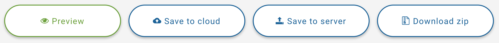

To download your package as a zip, click on the **Download zip** button.

The button will change into a small animated circle as it gathers the settings into a file for publishing, then it should either start downloading automatically or you should be prompted to save your zip file.

> If the button stops or encounters an error and turns red, there may be an error logged on your browsers developer console. Right-lick, choose Inspect, then click Console tab to see if anything makes sense. Errors are automatically logged with the developer.

Pressing the download button performs these steps:

1. Creates HTML5 files using built-in templates that reference all the required scripts for your media type.
2. Sets the completion requirement to the percentage watched requirement you set on the Completion tab.
3. Generate the appropriate IMS Manifest type for the package and include all the standard data-definition files for that package type
4. Generate a ZIP file in memory
5. Prompt you to download that ZIP file.

After you download the package, you can still go back to previous sections of the Assembler to make more changes and download again - the files are not "wiped" from your browser until you press the Reset link.

### Preview

Previewing will perform all the same steps as a download but then upload your file to a temporary location on our server and run a Scorm 1.2/2004 compatible testing environment and pop up an overlay window. This may give you a better feel for how your content will respond in your production environment. You can use the X icon (towards the top-right) to close the preview, or the paperclip icon to copy the URL of the preview in case you want to share it or try on other browsers.

### Save to cloud

This option pops up a cloud chooser service which allows you to store your file on a connected cloud provider.

### Save to server

This option will store your content on our server for the duration of your licence. If you have a 365 day licence the files will be stored for a year. For 1 or 10 day licences this option may not seem as useful. You can access and manage Saved courses through the Import screen.