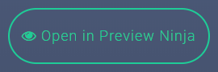

!! Selecting this option does NOT download your package - you will still need to return to the Assembler and select either **Download zip** or **Save to Cloud** to do that!

To test out your package and see how it will appear in a learning management system, click on the **Open in Preview Ninja** button.

This will launch the Preview Ninja in a new tab or window, where your course package will be uploaded for testing. You can then play the course and see how it works from a user's perspective.

!! If your browser has pop-up blockers enabled, be sure to allow pop-ups for the Assembler, otherwise it will not open.

After you open the Preview Ninja, you can still switch back to the Course Assembler to make more changes and preview again - the files are not "wiped" from your browser until you press the Reset link.

**For info on how on how the Preview Ninja works, [go here!](https://guide.coursesuite.ninja/previewninja)**