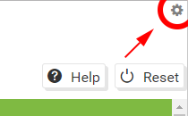
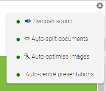

These settings are found by clicking the small gear icon in the very top right corner of the Assembler, above the Help and Reset buttons. This button is visible at all times.

As the name of this area suggests, all of these options are **enabled** by default. Simply click an item in the list to disable or re-enable it. Each item also has a colour-coded circle on the left - green means it's enabled, red means it's disabled.

!! Changes to these options will only affect new documents you import to the Assembler. Documents already in the Assembler won't be affected.

## Swoosh sound

If this setting is _enabled_, a a ninja-esque 'Swoosh!' noise plays whenever you switch between the _**Add Documents**_, _**Choose a Design**_ and _**Download your Package**_ tabs. Perfect for those of you who are action-oriented!

If this setting is _disabled_, switching between tabs is silent. If the 'Swoosh!' noise gets annoying after the hundredth time, don't worry, this allows a break for your ears.

---

## Auto-split documents

If this setting is _enabled_, any multi-page documents (Word docs, spreadsheets, slideshows, PDFs, etc) you import into the Assembler will be automatically split into multiple pages - each page becoming a seperate item in the file list. The first page in the document will also be made a parent page, while any other pages will be indented and set as child pages (though you can still rename, rearrange, or un-indent them at your discretion).

If this setting is _disabled_, these documents will be kept as a single file and a single page within the course. You can still view the whole document by scrolling up or down. You will also gain access to the [**Split**](https://guide.coursesuite.ninja/assembler/usage/add-documents/item-options#split) button, in case you decide to split the document at a later time.

---

## Auto-optimise images

If this setting is _enabled_, any images you import into the Assembler will be automatically resized and scaled to potentially reduce their file size. This can come in handy if you are importing particularly large files.

If this setting is _disabled_, images will be imported at their normal file size and dimensions (though they will still scale to fit the course display size when the course is played).

!! This setting depends on the size of the browser window (Chrome, Firefox, etc) when you import the image - for instance, importing an image into a small window will produce a smaller (and blurrier) image, which may be more apparent when the browser or course is viewed in a normal-sized window!

---

## Auto-centre presentations

If this setting is _enabled_, any Powerpoint or slideshow documents you import into the Assembler will be automatically centered.

! This setting currently cannot be disabled.