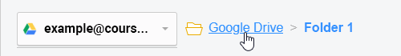
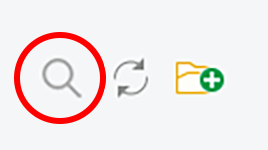
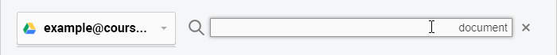
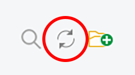
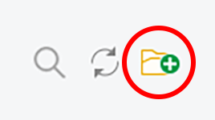
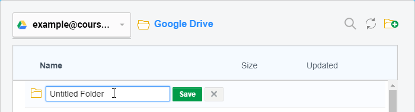
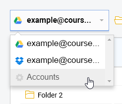

When you're [uploading documents from the cloud](https://guide.coursesuite.ninja/assembler/usage/add-documents/uploading-documents#upload-from-the-cloud), [importing packages from the cloud](https://guide.coursesuite.ninja/assembler/usage/add-documents/importing-packages#import-from-the-cloud) or [saving your package to the cloud](https://guide.coursesuite.ninja/assembler/usage/publishing-your-package/save-to-cloud), you'll be using the same interface in generally the same way. So rather than list everything on both of those pages, this section covers the whole process in a bit more detail.

### Connecting accounts

Whenever you click a button relating to a cloud service, a new popup will appear. If this is your first time using it, you will come to the Accounts area with a list of cloud storage services to choose from.

Click the button for whichever service you have an account for, and a new window will appear, prompting you to log in with your account details to connect it to the Assembler. The appearance of this window may differ depending on what service you select.

! You may also get an additional message requesting permission for The Kloudless Platform to connect to your account. You'll need to accept this in order to continue.

After you connect your account, it will appear in a list at the top of the window. You can then connect additional accounts if you wish - simply click on another service button below to repeat the process.

If you want to disconnect an account from the Assembler, click on the small red 'x' button to the right of the account details. The account will be disconnected immediately, so be sure you want it removed before clicking!

### Browsing & managing your storage

Click on a connected account to open the directory for that account - this is where any files and folders currently saved in that storage will be shown. Click on a folder to open it.

As you open folders, the chain of folders you've travelled through will appear at the top of the window. To go back to a previous folder, click on its name in this area.

Clicking the magnifying glass icon in the top right corner brings up a search bar. Enter some keywords here to search for them amongst your files - the results will filter automatically as you type. Click the small 'x' icon to the right to close the search bar if you need to.

! Only **files** show up in search results - folders aren't displayed, though the search covers every folder in your storage account, so nothing will be left out.

Clicking the rotating arrows icon in the top right corner refreshes the page. This may come in handy if you or someone else is changing content in your storage account while you're browsing it here, as it would allow you to catch up with any changes.

Clicking the folder '+' icon in the top right corner creates a new folder inside your current location, and prompts you to type in a name. You can then either click the green *Save* button to confirm the folder or click the 'x' button to cancel it.

!! **NOTE:** There is no option to delete or rename folders once you confirm them - you will need to log in to your cloud storage at their original sites to do that!

If you want to switch to other connected accounts or add new ones, click on the drop down menu in the top left corner of the window. From here, you can quickly select your other connected accounts, or click on **Accounts** to go back to the starting area to choose a new service to connect.

---

While everything mentioned above is the same regardless of how you got here, the end action is where things finally differ:

### If uploading documents or importing packages from the cloud

In this instance, you're **selecting the file** you want to upload to the Assembler.

Once you've found your preferred file, click on it once to select it, then hit the blue **Select** button in the bottom right corner. The cloud window will close and the file will upload to the Assembler.

### If saving packages to the cloud

In this instance, you're not selecting an individual file, but you're instead **choosing the folder** in which to save your course package.

Once you're opened your preferred folder, you don't need to click on any of the files in it - just hit the blue **Select** button in the bottom right corner. The cloud window will close and the package will save to the cloud.